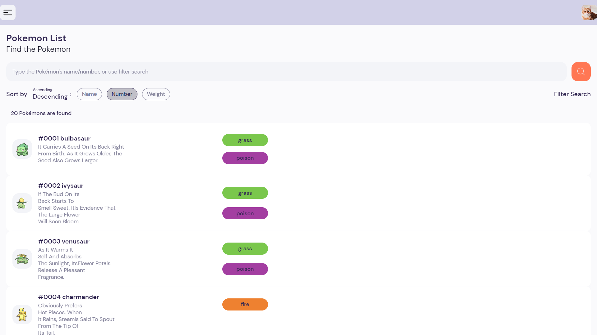
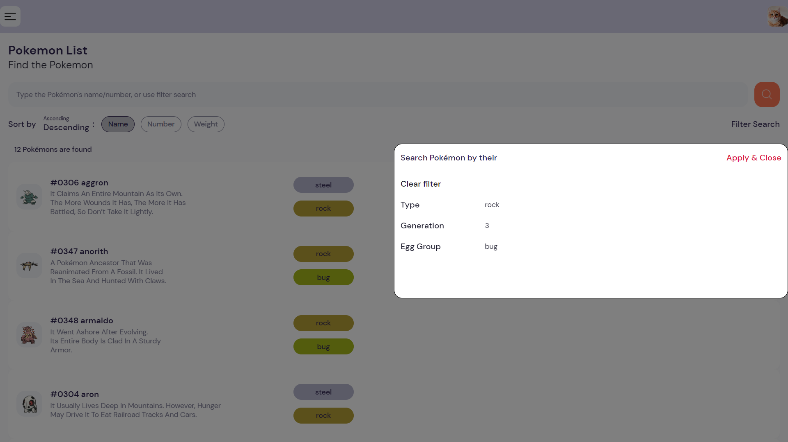
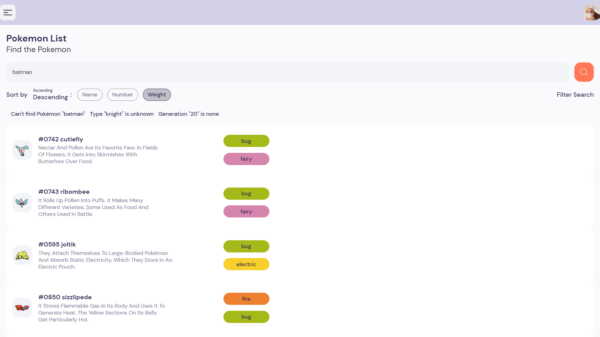

# Project Setup

## Implemented method
- State management using Redux
- Handle asynchronous actions with Redux Thunk
- Functionalities (search and sort features)
- Performance optimization, errors handling
- Write Redux logic test
- etc.

## Main Used Dependencies
- Redux Toolkit
- Expo
- Axios
- React Native
- Jest

## Architecture
- The program would enter from 'expo-router/entry' to App component in ./app/index.js.
- This App renders the header, Welcome, and PokemonList's components:
    - Welcome component:
        - Manages the search, sort, and filter functions.
        - All this functions returns query which later stored and used to query Pokemons.
        - Pokemon can be sorted ascendingly or descendingly by name, number, or weight.
    - PokemonList: 
        - Use the stored queries (search value, filter value(s)) to get all the Pokemon's ID.
        - Once the ID is compiled, a list of Pokemon's detail is produced by fetching pokemon/id one by one.
        - If there is no pokemon is found, the default list would be generated.
        - Since this is a simple App, the possible internal error would be logged in console only.
        - The list consists of pokemon's card which navigate to its detailed info when pressed.
- Redux is used to manage and store:
    - The values of search, sort, and filter functions.
    - An array of fetched ID, and the finalized list of pokemon's ID (reseted before new searches).
    - An array of the obtained Pokemon's information (stored until the App is refreshed).
- Jest is used to perform the unit testing as simple as possible. Tested:
    - Fetch and store data from real-time API.
    - Sort and store the updated ID's list.
    - Render component without problem.
    - Handle the possible error (typically caused by invalid uri)

# Sample Images
Default

Filter-search

Invalid-search

Random Display

